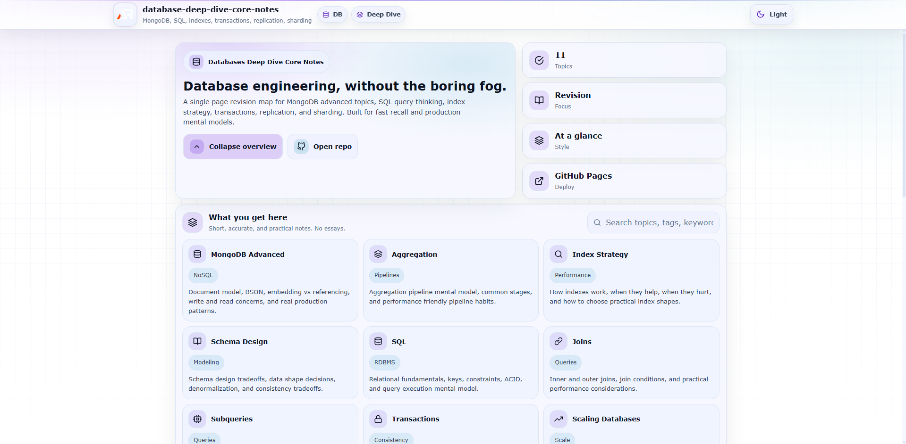

# Databases Deep Dive Core Notes

A single-page, at-a-glance revision project for modern database engineering concepts.

This project focuses on the practical mental models behind databases used in real production systems.
Instead of long theoretical chapters, the goal is fast recall, clear architecture understanding, and practical database design thinking.

---



---

## Purpose

- Quick revision before interviews
- Clear understanding of database internals and design decisions
- Practical reminders of SQL and NoSQL usage patterns
- Production oriented database engineering concepts
- Mental models used in real backend systems

---

## Coverage

### MongoDB Advanced

- Document model and BSON structure
- Embedded vs referenced documents
- Aggregation pipeline basics
- Pipeline stages (match, project, group, sort, lookup)
- Aggregation performance considerations
- MongoDB indexing strategies
- Compound indexes
- Partial indexes
- TTL indexes
- MongoDB transactions
- Write concerns and read concerns

---

### Aggregation

- Data processing pipelines
- Filtering with `$match`
- Data transformation with `$project`
- Grouping with `$group`
- Sorting results
- Pipeline optimization concepts
- Aggregation performance insights

---

### Index Strategy

- Why indexes exist
- B-Tree index fundamentals
- Primary vs secondary indexes
- Compound indexes
- Covering indexes
- Index selectivity
- When indexes slow down writes
- Index scanning vs full collection scan

---

### Schema Design

- Schema flexibility in NoSQL systems
- Embedding vs referencing
- One-to-many patterns
- Many-to-many patterns
- Denormalization strategies
- Read heavy vs write heavy design choices
- Data consistency tradeoffs

---

### SQL

- Relational database fundamentals
- Tables, rows, and columns
- Primary keys and foreign keys
- Data normalization concepts
- ACID properties
- Query structure and execution model

---

### Joins

- INNER JOIN
- LEFT JOIN
- RIGHT JOIN
- FULL JOIN
- Join conditions
- Join performance considerations
- When joins become expensive

---

### Subqueries

- Scalar subqueries
- Correlated subqueries
- EXISTS and NOT EXISTS
- Subquery vs join performance considerations
- Nested query execution model

---

### Indexes

- Index fundamentals
- Clustered vs non-clustered indexes
- B-tree structures
- Query optimization with indexes
- When indexes hurt performance
- Index maintenance cost

---

### Transactions

- ACID properties
- Atomicity
- Consistency
- Isolation
- Durability
- Isolation levels
- Transaction conflicts
- Distributed transaction challenges

---

### Scaling Databases

- Vertical scaling
- Horizontal scaling
- Read replicas
- Write bottlenecks
- Partitioning strategies
- Query distribution patterns

---

### Replication

- Primary-secondary replication
- Read replicas
- Replication lag
- Failover concepts
- High availability strategies

---

### Sharding

- Horizontal partitioning
- Shard keys
- Balanced data distribution
- Query routing
- Shard rebalancing
- Distributed query challenges

---

## Tech Stack

- React (Vite)
- Styled Components
- React Icons
- Modern JavaScript
- GitHub Pages deployment

---

## Project Structure

```
src
 ├─ components
 │   ├─ header
 │   ├─ footer
 │   ├─ about
 │
 ├─ topics
 │   ├─ mongoAdvanced
 │   ├─ aggregation
 │   ├─ indexStrategy
 │   ├─ schemaDesign
 │   ├─ sql
 │   ├─ joins
 │   ├─ subqueries
 │   ├─ indexes
 │   ├─ transactions
 │   ├─ scalingDatabases
 │   ├─ replication
 │   ├─ sharding
 │
 ├─ App.jsx
 ├─ main.jsx
```

---

## Design Philosophy

This project follows a simple principle:

- Minimal UI
- Maximum clarity
- Fast concept recall
- No unnecessary distractions

Each topic is presented as expandable sections designed for quick reading and strong mental mapping.

---

## Deployment

The project is deployed using **GitHub Pages**.

Build and deploy:

```
npm install
npm run build
npm run deploy
```

---

## Status

Active development

Topics will continue expanding with more real-world insights, performance notes, and architecture patterns.

---

## Author

Ashish Ranjan

---

## Follow

GitHub: github.com/a2rp
Portfolio: ashishranjan.net
LinkedIn: linkedin.com/in/aashishranjan
Facebook: facebook.com/theash.ashish/
Youtube: youtube.com/@ashishranjan-ashz
