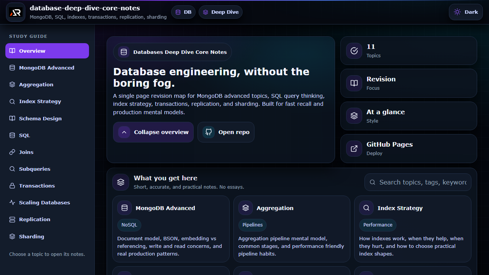

# Databases Deep Dive Core Notes

A single-page revision guide for practical database engineering concepts, including SQL, MongoDB, indexing, transactions, replication, scaling, and sharding.

## Features

- Topic-based study guide with focused database notes
- Practical mental models for SQL and NoSQL design
- Notes on indexes, schema design, joins, transactions, replication, and scaling
- Dark and light themes with persistent preference
- Responsive fixed study navigation and go-to-top control

## Tech stack

React, Vite, styled-components, React Icons, and CSS.

## Run locally

Run npm install, then npm run dev. Use npm run build to create a production build and npm run deploy to publish it to GitHub Pages.

## Links

- Portfolio: [https://www.ashishranjan.net](https://www.ashishranjan.net)
- GitHub: [https://github.com/a2rp](https://github.com/a2rp)
- CodePen: [https://codepen.io/ash1198](https://codepen.io/ash1198)
- LinkedIn: [https://www.linkedin.com/in/aashishranjan](https://www.linkedin.com/in/aashishranjan)
- Facebook: [https://www.facebook.com/theash.ashish/](https://www.facebook.com/theash.ashish/)
- YouTube: [https://www.youtube.com/@ashishranjan-ashz?sub_confirmation=1](https://www.youtube.com/@ashishranjan-ashz?sub_confirmation=1)
- Email: [ash.ranjan09@gmail.com](mailto:ash.ranjan09@gmail.com)

## Support

- Support: [https://a2rp-donation-page.netlify.app/](https://a2rp-donation-page.netlify.app/)
- Buy Me a Coffee: [https://buymeacoffee.com/a2rp](https://buymeacoffee.com/a2rp)
- Patreon: [https://patreon.com/a2rp](https://patreon.com/a2rp)
